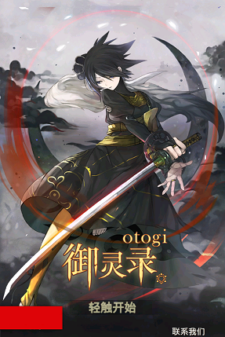

# otogi-mochi-mfr
Tool for modding Otogi Secret Spirit Agents image assets. ~~Sponsored by Mikado sama.~~

# Usage

- Place the latest "AssetBundlesInfo.json"(can be found in <app-cache-path>/files/Bundle2) with the executalbe file.
- Place png images under input folder(along with the executable file), with path matching "input/cards/<6-digits-daemon-id>/(hd|sd|team|drama|icon|avatar).png" for daemons. Or "input/textures/loadingcard/<3-digits-daemon-id>.png" for loading screen.
- Run the executable file. Then you will get the assets in the output folder.
- Override the conent in <app-cache-path>/files/Bundle2 with the files in the output folder.

# Result

